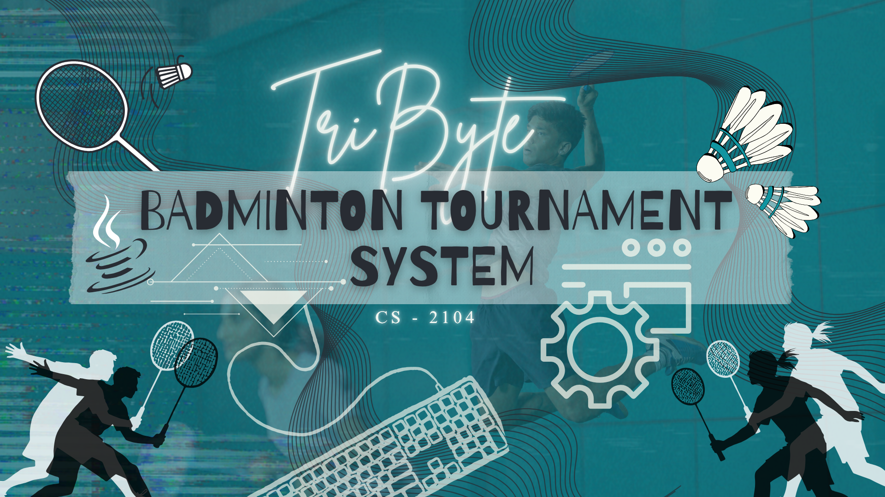
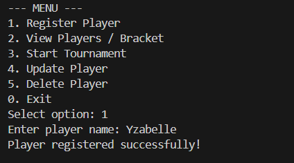
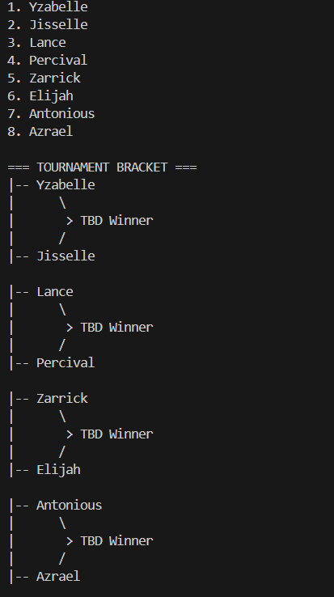
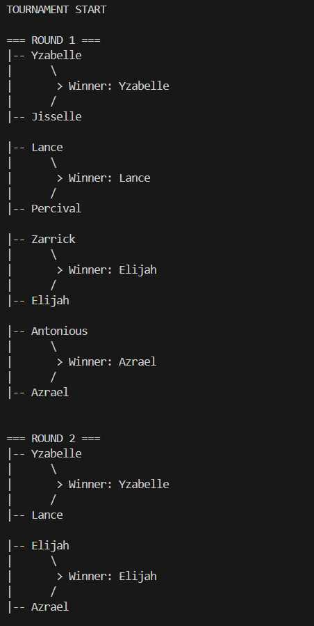
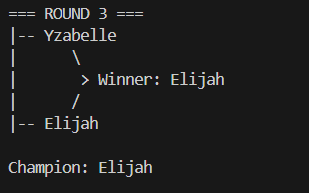
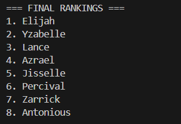
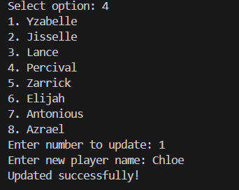
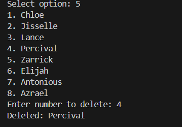
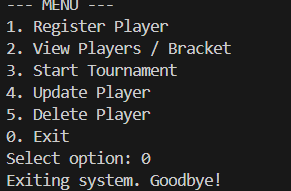

<h1 align = "center">🏸 Badminton Tournament System </h1> 

### *A Java Console System Demonstrating Object-Oriented Programming*


## 📝 Overview
<p align="justify">
  
The *Badminton Tournament System* is a Java console-based application designed to efficiently organize and manage badminton competitions. Users can choose the tournament type between Single Elimination or Double Elimination and navigate a clear, interactive menu that offers the following options:
  
- 📝 Register Players
- 👀 View Players and Brackets
- 🏸 Start the Tournament
- ✏️ Update Player or Bracket Information
- 🗑️ Delete Players

The system demonstrates the four key Object-Oriented Programming (OOP) principles—encapsulation, inheritance, abstraction, and polymorphism—through its well-structured class design and method implementation. By integrating exception handling, arrays, and user-driven console interactions, the project provides a practical and engaging simulation of real-world tournament management, highlighting both functionality and good programming practice. 

## 🧠 Object-oriented Principles
### 🔒 Encapsulation
- Class fields such as `name` in Player, `teamName/player1/player2` in Team, and `participants` in Tournament are private. Access is controlled through getters and setters, ensuring data safety and validity.
### 🎭 Abstraction
- Abstract classes like Participant and Tournament hide complex logic. Only essential methods are exposed, such as: `getDisplayName()` in Participant and `createParticipantFromInput()` in Tournament. The system can work with different types of participants without needing to know their internal details.

### 🧬 Inheritance
- `Player` and `Team` inherit from `Participant`.
- `SinglesTournament` and `DoublesTournament` inherit from `Tournament`.
Shared behaviors are reused while subclass-specific features remain customizable.

### 🔁 Polymorphism
- A single list of `Participant` objects can hold `Player` and `Team` instances.
- Methods like `getDisplayName()` or `updateLabel()` automatically call the correct overridden version depending on the object type.

### 📊 UML DIAGRAM 
 

## ▶️ How to Run the Program
### 1️⃣ Save the Code
Save your Java file as:
  ```bash
BadmintonTournamentSystem.java
  ```
## 2️⃣ Compile the Program
Open Command Prompt/Terminal and navigate to the file directory:
  ```bash
javac BadmintonTournamentSystem.java
  ```
## 3️⃣ Run the Program
  ```bash
java BadmintonTournamentSystem
  ```
## 4️⃣ Follow On-Screen Instructions
  ```text
    Choose Competition Type:
    1. Singles Competition
    2. Doubles Competition
    Enter choice: 
    
    --- MENU ---
    1. Register Player
    2. View Players / Bracket
    3. Start Tournament
    4. Update Player
    5. Delete Player
    0. Exit
    Select option: 
  ```
## 🖥 Sample Output
<details>
  <summary><strong>Competition Type Selection</strong></summary>
  <br>
  
  
  <p align="center"><em>The Competition Type Selection, showing 2 options.</em></p>
</details>

<details>
  <summary><strong>Main Menu & Registering Participants</strong></summary>
  <br>
  
  
  <p align="center"><em>The Main Menu and Registering Participants, showing 6 options.</em></p>
</details>

<details>
  <summary><strong>Viewing Players and Brackets</strong></summary>
  <br>
  
  
  <p align="center"><em>The output showing all registered participants and the tournament bracket.</em></p>
</details>

<details>
  <summary><strong>Starting Tournament</strong></summary>
  <br>
  
  
  
  <p align="center"><em>The tournament rounds and winners display.</em></p>
</details>

<details>
  <summary><strong>Final Ranking</strong></summary>
  <br>
  
  
  <p align="center"><em>The output showing final rankings of all participants.</em></p>
</details>

<details>
  <summary><strong>Updating a Participant</strong></summary>
  <br>
  
  
  <p align="center"><em>The prompt for updating a player’s or team’s information.</em></p>
</details>

<details>
  <summary><strong>Deleting a Participant</strong></summary>
  <br>
  
  
  <p align="center"><em>The prompt for deleting a player or team from the tournament.</em></p>
</details>

<details>
  <summary><strong>Exit</strong></summary>
  <br>
  
  
  <p align="center"><em>The system exit message.</em></p>
</details>

## ✍️ Contributors
|  | Name | Year | Github Account |
|--------|------|------|--------| 
|  | **Chloe Yzabelle Gonzaga** | 2nd Year|[|
|  | **Jiselle Mae Silla** | 2nd Year | [|
|  | **Lance Buenviaje** | 2nd Year | [|


## ✨ Acknowledgement
<p align="justify"> 

We would like to express our heartfelt gratitude to **Mr. Emmanuel Charlie Enriquez** for his sincere support and encouragement throughout the development of this project. Your dedication to teaching us and your thoughtful guidance helped us think critically and improve at every stage. We are truly grateful for the time and effort you devoted to helping us grow. This project would not have been possible without your unwavering support.

We would also like to give a special mention to **Ms. Fatima Marie Agdon** for her continuous assistance and motivation. Your insights and encouragement contributed greatly to our learning experience, and we deeply appreciate your presence and support along the way.

*Sincerely,*

*TriByte*


  


  


  
